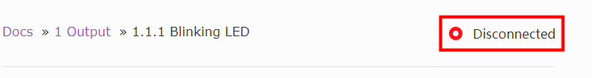

Download and Install
===============================================

In our tutorials you will see the word **Disconnected** in the top right corner, click on it to connect and run commands and code to the Raspberry Pi, but you need to download the SunFounder Create Agent first.

Here are the tutorials for installing on different systems:

* :ref:`download_install_windows`
* :ref:`download_install_macos`
* :ref:`download_install_raspberrypios`

.. _download_install_windows:

Windows 
---------------

1. Click on **Disconnected**, and select **Download the Agent** in the pop-up window. If you have already downloaded and installed it, please see :ref:`Quick User Guide`.

    .. image:: media/image2.png
        :align: center

#. Click on the downloaded ``SunFounder-Create-Agent-win32-xx.x.x.exe`` file, which is usually in the ``Downloads/`` folder.

#. Select install mode.

    .. image:: media/image3.png
        :align: center

#. The default installation path is shown in the figure. You can also choose another path by using the **Browse** button and click **Next**.

    .. image:: media/image5.png
        :align: center

#. Select whether to create a desktop shortcut.

    .. image:: media/image6.png
        :align: center

#. Click **Install** to continue with the installation, or click **Back** if you want to review or change any settings.

    .. image:: media/image7.png
        :align: center

#. Wait a very short time and when the following pop-up window appears, the installation is successful. In this pop-up window, **Launch SunFounder Create Agent** is checked by default, click **Finish**, and this Agent will be run at this time.

    .. image:: media/image8.png
        :align: center

    .. image:: media/im9.png
        :align: center

.. _download_install_macos:

Mac OS
--------------------------------------

1. Click on **Disconnected**, and select **Download the Agent** in the pop-up window. If you have already downloaded and installed it, please see :ref:`Quick User Guide`.

    .. image:: media/image2.png
        :align: center

#. Click on the downloaded ``SunFounder-Create-Agent-darwin-xx.x.x.dmg`` file, which is usually in the ``Downloads/`` folder.

    .. image:: media/image12.png
        :align: center

#. Drag the ``SunFounder-Create-Agent-darwin-xx.x.x.dmg`` to the **Applications** folder to install it.

    .. image:: media/image13.png
        :align: center

.. _download_install_raspberrypios:

Raspberry Pi OS
------------------------------------

1. Click on **Disconnected**, and select **Download the Agent** in the pop-up window. If you have already downloaded and installed it, please see :ref:`Quick User Guide`.

    .. image:: media/image2.png
        :align: center

#. Click on the downloaded ``SunFounder-Create-Agent-linux-xx.x.x.deb`` file, which is usually in the ``Downloads/`` folder，then select **Install**.

    .. image:: media/image22.png
        :align: center

#. Enter the username and password, click **OK**.

    .. image:: media/image23.png
        :align: center

#. Wait for a very short time, when the pop-up window disappears, the installation is successful.

    .. image:: media/image24.png
        :align: center

If the installation is not successful, please refer to the :ref:`FAQ`.