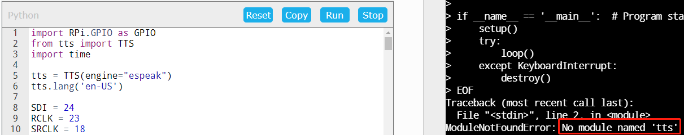
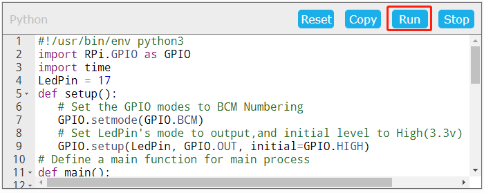

FAQ 
=============

What kind of operating systems does Agent support?
------------------------------------------------------

Currently Agent supports **Win10**, **macOS Big Sur 11.5**, **Raspberry Pi OS Buster** and above.

Agent installation failed?
------------------------------------

The Agent may fail to install in Raspberry Pi OS, in which case you need to update via ``sudo apt update``.

.. image:: media/image29.png
    :align: center

After the update is successfully installed, double-click ``SunFounder-Create-Agent-linux-xx.x.x.deb`` again to install.

.. image:: media/image30.png
    :align: center

Recognizes as a \"virus\"?
-----------------------------------

If during the process of installing the Agent, some security protection software recognizes it as a \"virus\", please trust this software. If possible, please give us a screenshot, and we will actively communicate with them.

* Email: cs@sunfounder.com

Agent connection failed?
------------------------------

If you run the code without opening SunFounder Create Agent, Agent connection failed will pop up. Reopen SunFounder Create Agent, 
click \"Try again\" to reconnect.

    .. image:: media/image39.png
        :align: center

**Run** button doesn't work?
-----------------------------

When you click Run, the command or code doesn't run, there are 2 reasons.

* Raspberry Pi is disconnected, you need to disconnect by clicking ip -> Disconnected in the top right corner and then reconnect again.
* There is a program running, you need to stop it first when you click Run next time.

Unable to edit in Terminal?
---------------------------------

* You need to click on the right area first before you can start entering commands on the Terminal.
* Or if the Raspberry Pi has been disconnected, you need to reconnect by clicking on the ip -> Disconnected in the top right corner.

No module named \'xxxxx\'？
----------------------------------------------------

Because some codes need to manually install the module, you need to run the command on the page to install the module.

Or run under a specific path, because some libraries are not provided by the Raspberry Pi, but provided by SunFounder. Generally, these modules will be placed under the ``xxxx/python/`` path, so you need to enter this path before running the code.

Can only run Python code, but not C?
-------------------------------------------------------------

Because Run button is basicly copy commands and hit enters for you, it only works if everything in the editor can run in terminal. And for Python, it also adds a python command ahead to run it under python. You can run Python code directly with Python command, but you cannot do it with C. You can still run commands to compile C into an excutable and run it.

What browsers are supported?
-----------------------------------
#. SunFounder Create Agent currently supports **Chrome** and **Firefox** browsers, and does not support **Safari** and **Internet Explorer** browsers.