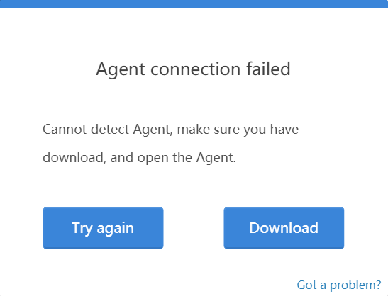
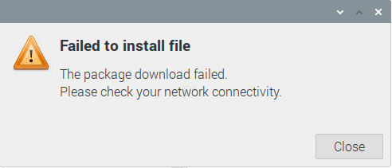
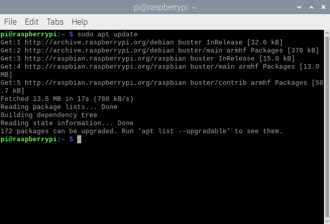

FAQ 
=============

1. If you run the code without opening SunFounderCreateAgent, 
a connection failure prompt will pop up. After reopening SunFounderCreateAgent, 
click \"Try again\" to reconnect.

2. ReadTheDoc currently does not support Safari and Internet Explorer browsers. 
Support Chrome, Firefox and other browsers.

3. If the installation fails during the installation process, 
please open the Raspberry Pi Terminal and run the code ``sudo apt update``, after success, 
double-click SunFounder-Create-Agent-linux-v1.0.0.deb to install.

