Linux
===================================

1. Enter the corresponding ReadTheDocs tutorial address 
in the browser to enter the tutorial page.

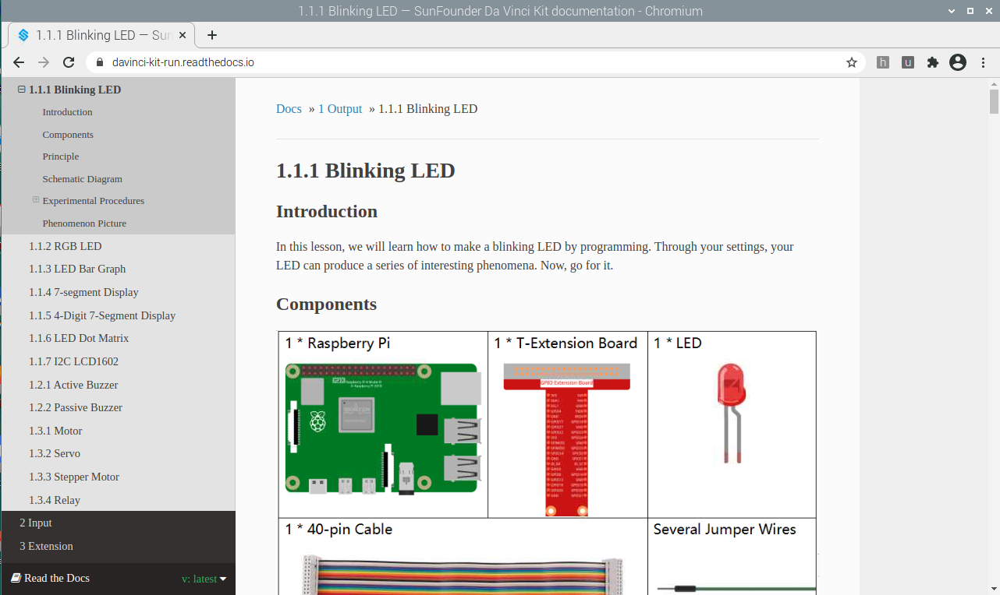

2. Click \"Disconnected\".

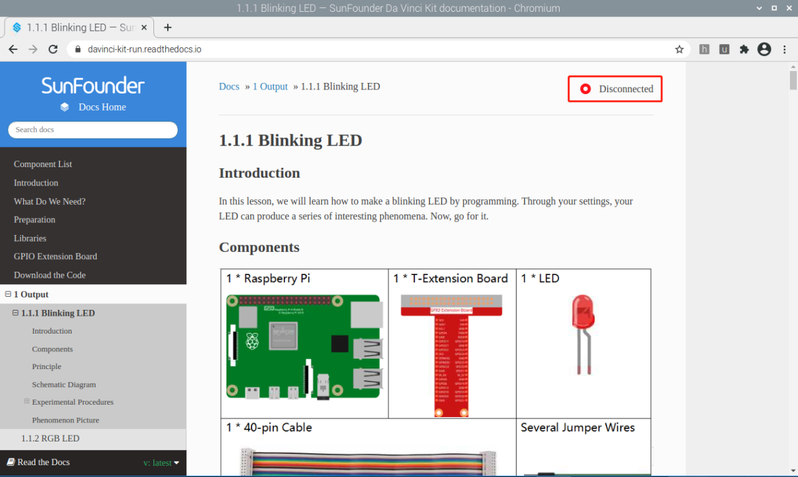

3. Please download SunFounderCreateAgent for the first use, 
and download it by clicking \"Download the Agent\".

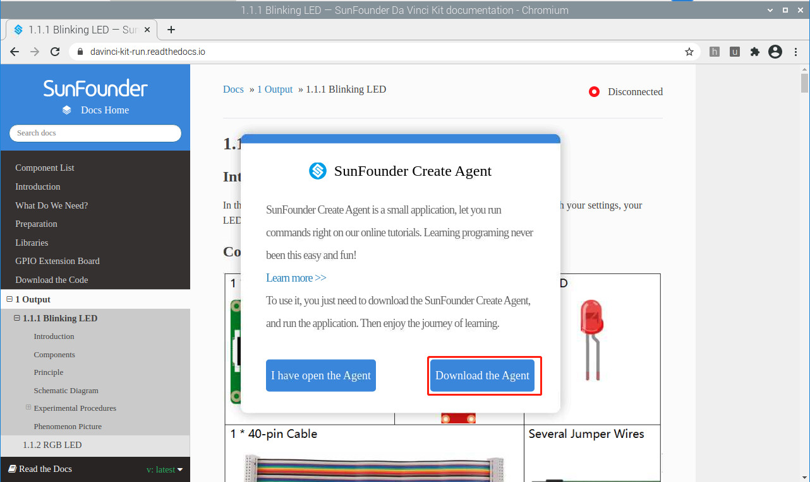

4. After the download is complete, double-click the 
SunFounder-Create-Agent-linux-v1.0.0.deb file to install it.

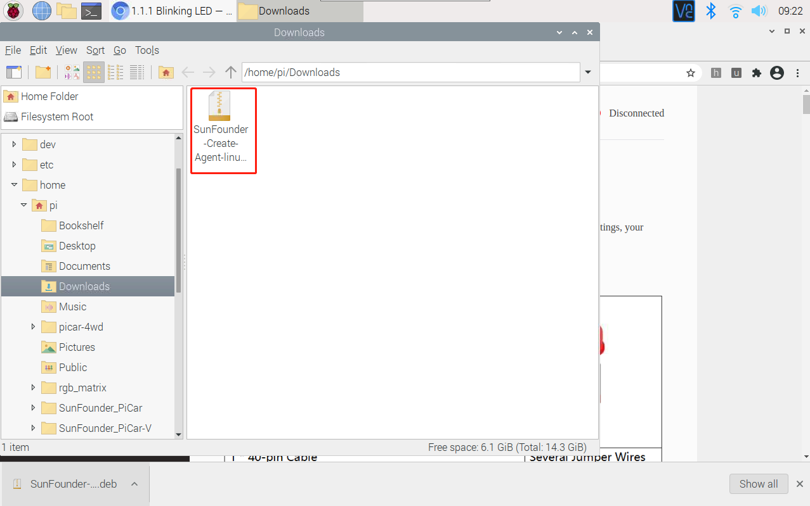

Click \"install\" to install.

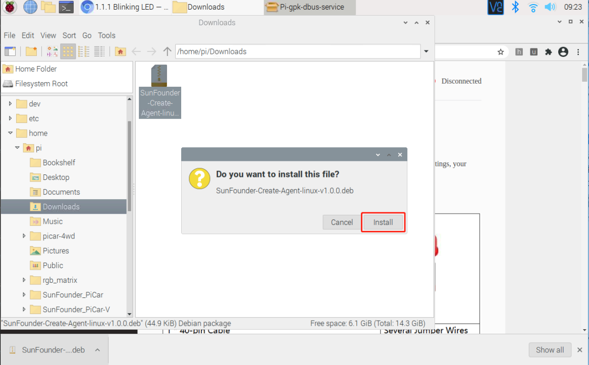

Enter the raspberry username and password, and click \"OK\".

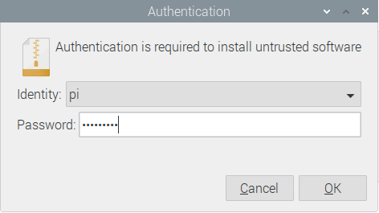

Waiting for installation.

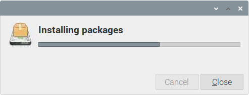

The installation is successful when the installation popup disappears!

5. Run SunFounderCreateAgent: Click \"Accessories\" in the Raspberry Pi menu and select Sunfounder
Create Agent to run the software.

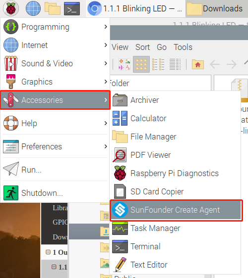

After running, a Note prompt box will pop up, and a small SunFounderCreateAgent icon will appear in the taskbar.

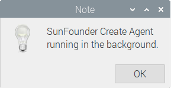

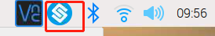

6. Exit SunFounderCreateAgent: Click the small SunFounderCreateAgent icon 
in the taskbar of the Raspberry Pi and select \"Quit\" to exit.

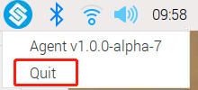

