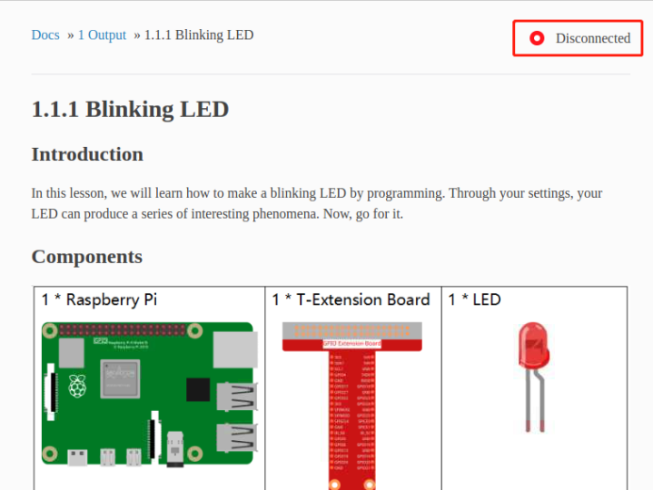
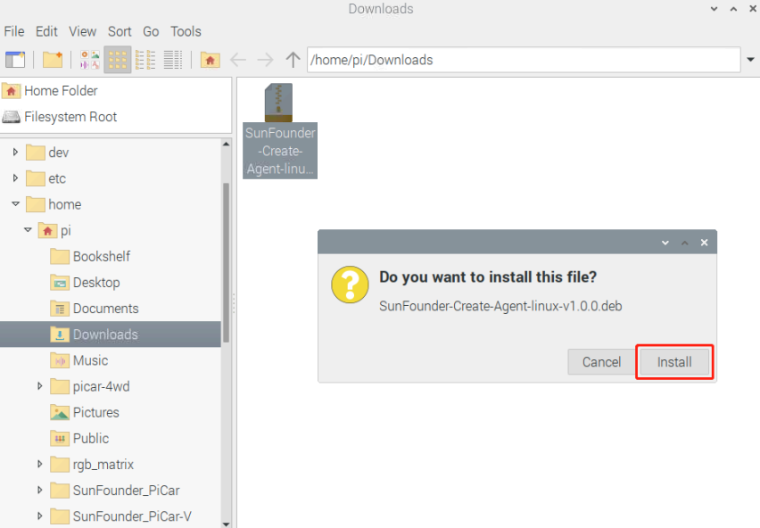

Linux
===================================

1. Enter the corresponding ReadTheDocs tutorial address in the browser to enter the tutorial page, and click \"Disconnected\".

2. Please download SunFounder Create Agent for the first use, and download it by clicking \"Download the Agent\".

.. image:: media/image20.png

3. After the download is complete, double-click the SunFounder-Create-Agent-linux-v1.0.0.deb file to install it.

Click \"install\" to install.

Enter the raspberry username and password, and click \"OK\".

Waiting for installation.

The installation is successful when the installation popup disappears!

4. Run SunFounder Create Agent: Click \"Accessories\" in the Raspberry Pi menu and select Sunfounder Create Agent to run the software.

.. image:: media/image25.png
    :align: center

After running, a Note prompt box will pop up, and a small SunFounder Create Agent icon will appear in the taskbar.

5. Exit SunFounder Create Agent: Click the small SunFounder Create Agent icon in the taskbar of the Raspberry Pi and select \"Quit\" to exit.

