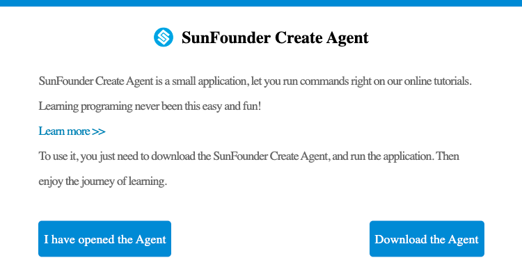
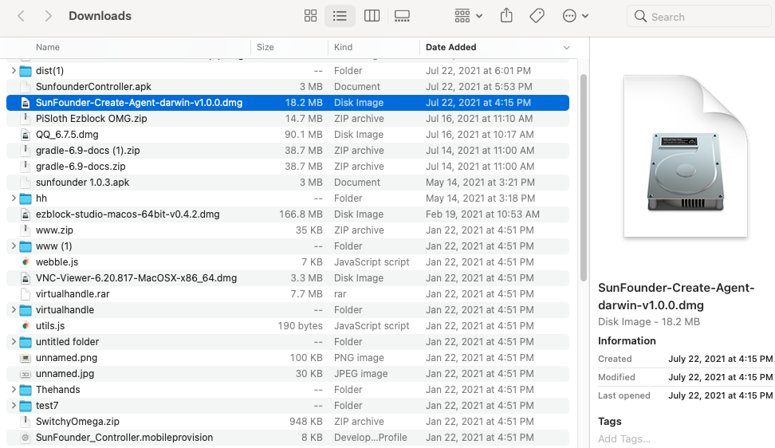

Mac
==============================

1. Enter the corresponding ReadTheDocs tutorial address in the browser to enter 
the tutorial page (the Safari browser is not currently supported).

2. Click \"Disconnected\".

3. Please download SunFounderCreateAgent for the first use, 
and download it by clicking \"Download the Agent\".

4. After the download is complete, you can double-click 
SunFounder-Create-Agent-darwin-v1.0.0.dmg to install it.

5. Place the SunFounderCreateAgent icon on the Applications icon, that is, 
add SunFounder Create Agent to Applications.

6. Run SunFounderCreateAgent: Open Finder, enter the application, and double-click SunFounder
Create Agent, you can also enter the startup station to run SunFounder Create Agent.

.. image:: media/image14.png
    :align: center

After the prompt box pops up, select \"Open\".

The Note prompt box pops up to indicate successful operation!

7. Exit SunFounder-Create-Agent: Click SunFounder-Create-Agent of the computer task
A small icon will pop up in the menu bar, click \"Quit\" to exit.

