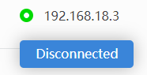

Quick User Guide
============================

Connect to Raspberry Pi
------------------------

1. You will need to run this Agent manually every time your computer restarts. The usual method is to find the SunFounder Create Agent you installed, and then open it to let it run in the background.

   * :ref:`run_quit_windows`
   * :ref:`run_quit_macos`
   * :ref:`run_quit_raspberrypios`

#. Click **Disconnected**.
    
    .. image:: media/image1.png
            :align: center
   
#. If you do not have the Agent installed, please click **Download the Agent**, detailed tutorial refer to: :ref:`Download and Install`. If you have downloaded and installed the Agent and have it running, click **I have the opened the Agent**.

    .. image:: media/image2.png
        :align: center

#. Click **OK**.

    .. image:: media/image32.png
        :align: center

#. Enter the Raspberry Pi IP, username and password, and click **Connect**. 

    .. note::

        If you are reading the tutorial on Raspberry Pi and want to connect with itself, you can use local ip address 127.0.0.1 or local network name localhost

    .. image:: media/image33.png
        :align: center

#. The connection is successful and you can now run the code directly from your browser.

.. image:: media/image34.png
    :align: center

Run the Command and Code
------------------------------------

1. After successful connection, the Raspberry Pi IP will be displayed in the upper right corner. And Terminal will appear on the right side.

    .. image:: media/image35.png
        :align: center
    

#. On the page, you will see some command lines and codes with boxes as shown below, which means you can **Reset/Copy/Run/Stop** them directly. 

    .. image:: media/image38.png
        :align: center

   * **Reset**: Reset to initial state.
   * **Copy**: Copy the complete command or code to the clipboard. This function is generally used when you have modified the code and there is no problem with debugging. You can copy the complete code and paste it into the source ``.py`` file.
   * **Run**: To run the command or code, you need to stop the previous run before you click Run next time.
   * **Stop**: Equivalent to ``Ctrl+C``, used to stop a command or code.

#. The Terminal on the right side is also editable，but you need to click on the right area first before you can start entering commands.

    .. image:: media/terminal_nano.png
        :align: center

#. You can disconnect the Raspberry Pi by clicking ip -> Disconnected in the top right corner.

