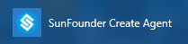
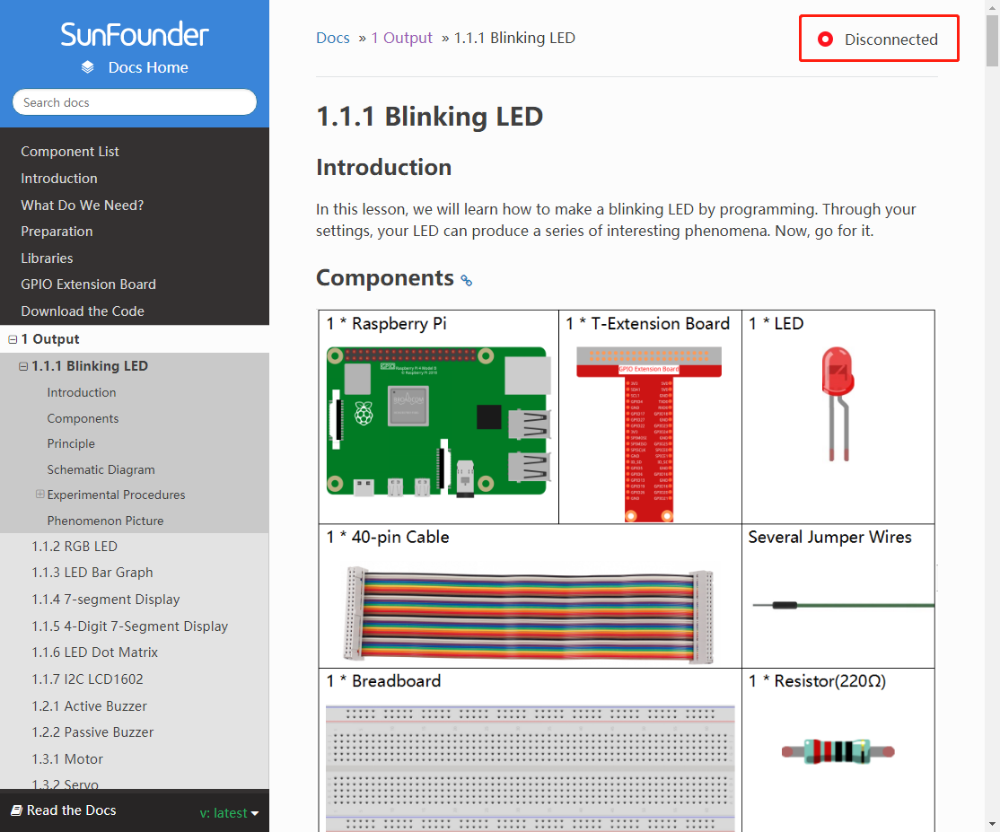
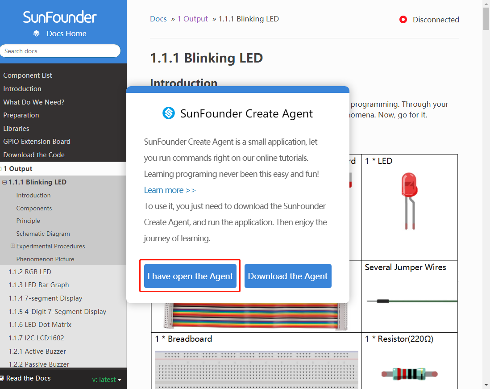
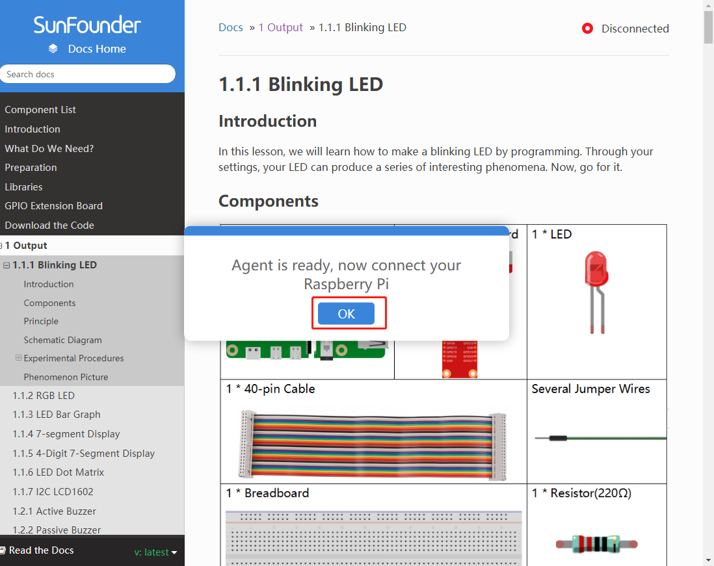
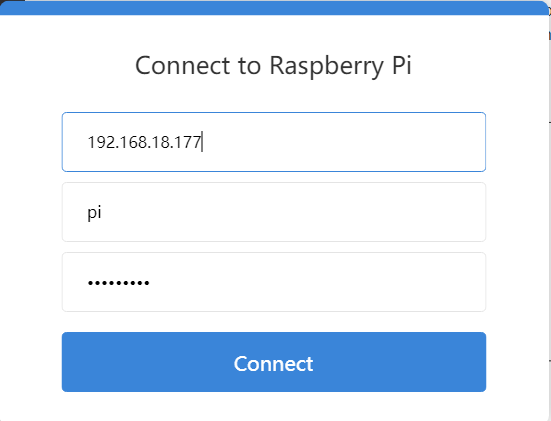
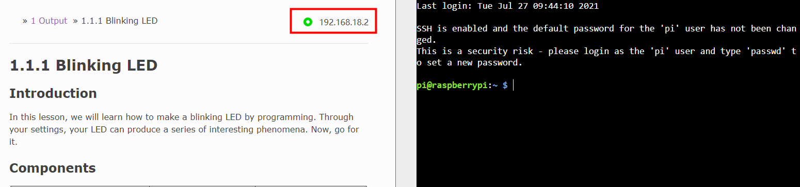
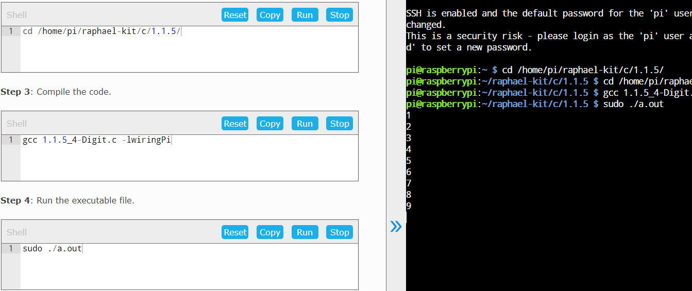

Quick User Tutorial
============================

Connect Raspberry Pi
------------------------

1. Select SunFounder Create Agent icon to open it.

2. SunFounder Create Agent connects to Raspberry Pi: Open the ReadTheDoc tutorial webpage, Click \"Disconnected\".
    

   
3. click \"I have open the Agent\".

4. Click \"OK\".

5. Enter the Raspberry Pi IP, username and password on the Connect to Raspberry Pi interface, and click \"connect\"(please enter \"127.0.0.1\" for the Raspberry Pi system connection IP).

6. Connection succeeded.

Use and Interface Introduction
------------------------------------

1. After the connection is successful, the IP of the currently connected Raspberry Pi will be 
displayed in the upper right corner of the tutorial bar on the ReadTheDoc page, 
and the command bar will be displayed on the right side of the page. Click the IP again, 
and \"Disconnected\" will be displayed. 
You can disconnect from the Raspberry Pi by clicking \"Disconnected\".

    

2. **Run:** Click the \"Run\" button in the code box, and the code will be executed in the command box on the right.

  **Reset:** to reset the code box code.

  **Copy:** to copy the code box code.

  **Stop:** to stop the code box code.

