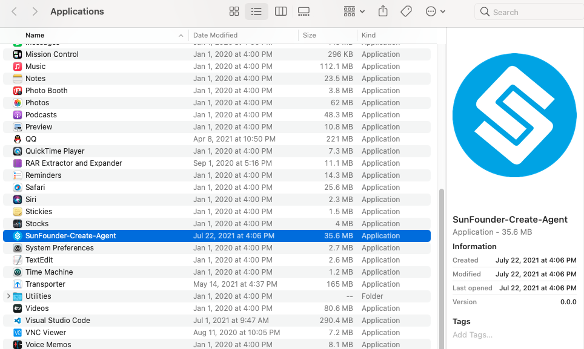
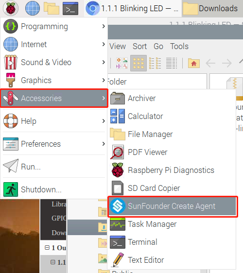

Run or Quit
===========================

You will need to run this Agent manually every time your computer restarts. The usual method is to find the SunFounder Create Agent you installed, and then open it to let it run in the background.

* :ref:`run_quit_windows`
* :ref:`run_quit_macos`
* :ref:`run_quit_raspberrypios`

.. _run_quit_windows:

Windows
-------------

**Run**

You will need to run this Agent manually every time your computer restarts. If you created a desktop shortcut, then you can find the following icon and double-click it to run.

If you have not created a shortcut, you can search for: Sunfounder Create Agent in the search box in the lower left corner, click it to run.

**Quit**

Generally, it only runs in the background and does not affect other processes. If you want to quit it, after finding it in the taskbar, right click and select **Quit**.

.. _run_quit_macos:

Mac OS
----------------------------

**Run**

You will need to run this Agent manually every time your computer restarts. Find it in the Applications folder, click and select **Open** to make it run in the background.

**Quit**

Generally, it only runs in the background and does not affect other processes. If you want to quit it, after finding it in the taskbar, right click and select **Quit**.

.. image:: media/image17.png
    :align: center

.. _run_quit_raspberrypios:

Raspberry Pi OS
-----------------------------------

**Run**

You will need to run this Agent manually every time your computer restarts. Click on the Raspberry Pi menu icon in the upper right corner and select **Accessories** --> **Sunfounder Create Agent**.

After a while a pop-up will show that it is already running in the background.

**Quit**

Generally, it only runs in the background and does not affect other processes. If you want to quit it, after finding it in the taskbar, right click and select **Quit**.

.. image:: media/image28.png
    :align: center
