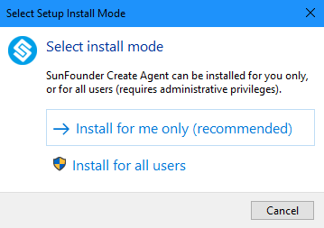
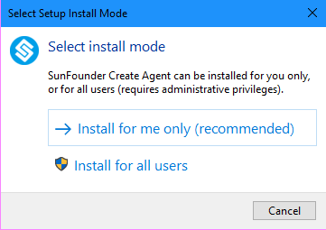
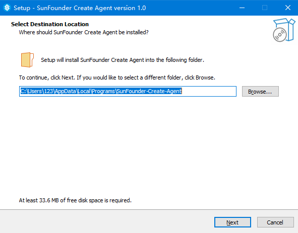
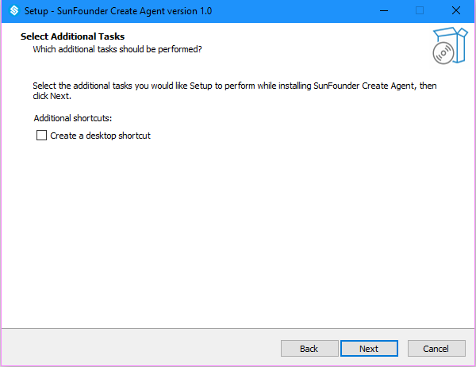
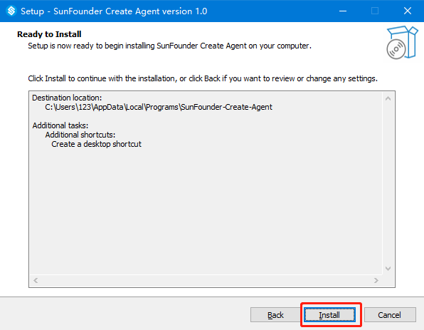
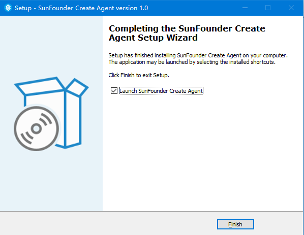

Windows 
=================================

1. Enter the corresponding ReadTheDocs tutorial address in the browser to enter the tutorial page, and click \"Disconnected\".

.. image:: media/image2.png
    :align: center

2. Please download SunFounder Create Agent for the first use, and download it by clicking \"Download the Agent\".

3. Install SunFounder-Create-Agent.exe.

4. Select install mode.

5. The installation location can choose to install the default location, or you can choose the directory you want to install. After the selection is complete, click \"Next\".

6. Choose whether to create a desktop shortcut according to your needs and then click \"Next\".

7. Install.

8. The installation is complete. After clicking "Finish", SunFounder Create Agent will run automatically.

