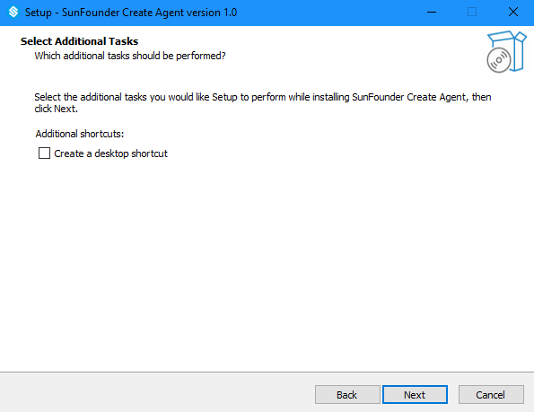
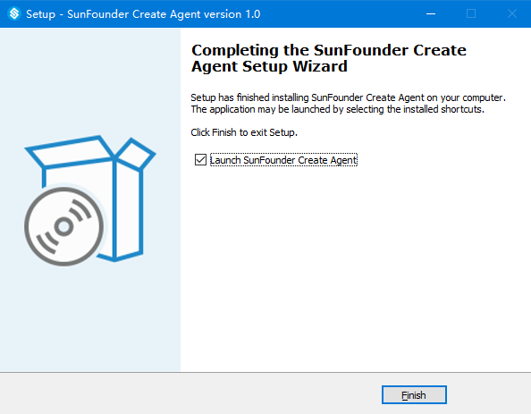

Windows 
=================================

1. Enter the corresponding ReadTheDocs tutorial address 
in the browser to enter the tutorial page.

.. image:: media/image1.png
    :align: center

2. Click \"Disconnected\".

.. image:: media/image2.png
    :align: center

3. Please download SunFounderCreateAgent for the first use, 
and download it by clicking \"Download the Agent\".

4. Open the downloaded SunFounderCreateAgent.exe file to install it.

5. Click \"Install for me only\" to enter the selection of installation location.

.. image:: media/image4.png
    :align: center

6. The installation location can choose to install the default location,
or you can choose the directory you want to install.
After the selection is complete, click \"Next\".

7. Choose to create a desktop shortcut and then click \"Next\".

8. Click \"Install\" to install.

.. image:: media/image7.png
    :align: center

9. After the installation is complete, 
you can double-click the desktop icon to run SunFounderCreateAgent.

