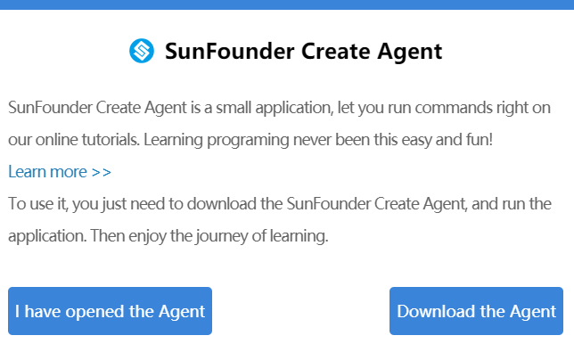

Windows 
=================================

1. Enter the corresponding ReadTheDocs tutorial address 
in the browser to enter the tutorial page.

2. Click \"Disconnected\".

3. Please download SunFounder Create Agent for the first use, 
and download it by clicking \"Download the Agent\".

.. image:: media/image3.png
    :align: center

4. Install SunFounder-Create-Agent.exe 

5. Select install mode.

.. image:: media/image99.png
    :align: center

6. The installation location can choose to install the default location,
or you can choose the directory you want to install.
After the selection is complete, click \"Next\".

.. image:: media/image5.png
    :align: center

7. Choose whether to create a desktop shortcut according to your needs and 
then click \"Next\".

.. image:: media/image100.png
    :align: center

8. Install.

.. image:: media/image7.png
    :align: center

9. The installation is complete. 
After clicking "Finish", SunFounder Create Agent will run automatically.

.. image:: media/image8.png
    :align: center
